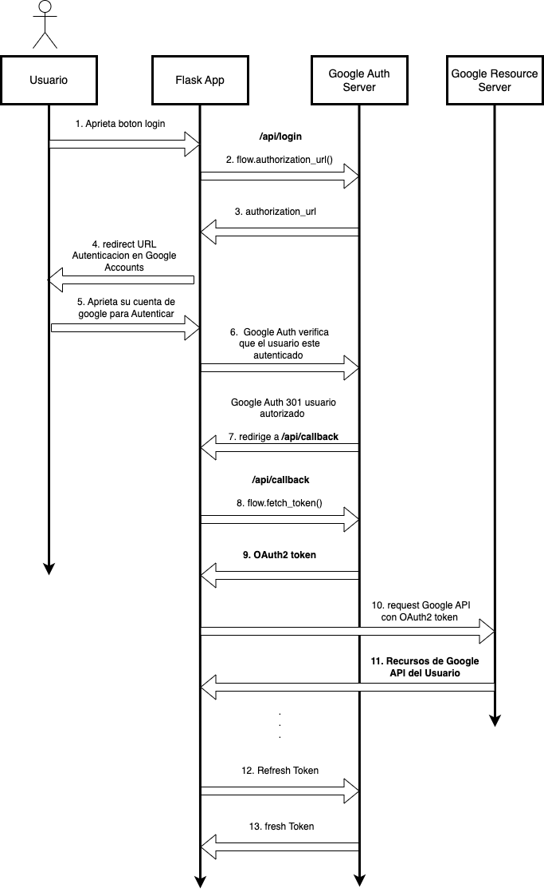

# Arquitectura de microservicios 

Arquitectura minimalista funcional, escalable y segura

Microservicios:

    * backend -> Flask Web Server, OAuth2

    * bd -> muySQL para guardar Usuarios AUthorizados

    * frontend -> React

    * nginx -> proxy inverso, load balancer, API Gateway


</br>


## Microservicio Backend

Flask -> Web Server Framework
OAuth2 -> Autenticacion y Autorizacion con Google

1. Autenticacion
2. Autorizacion

Una vez autenticado y autorizado, el usuario puede acceder a la seccion protegida

un usuario autenticado y autorizado puede acceder a info protegida, guardar data protegida, tratamiento personalizado con IA de recomendacion.

un usuario no logueado solo puede acceder a muestras, pero no tiene IA personalizada de recomendacion ni guarado persistente de data


</br>


## Microservicio db

mySQL para guardar Authorizaciones y Permisos

depende de backend


</br>

## Microservicio nginx 

proxy inverso (load balancer) para comunicacion entre microservicios

la idea es extenderlo a API Gateway


</br>

## Microservicio frontend

tecnologias:
    . nodejs 
    . React


<br/>
------------------------------------------------------------------------
<br/>


## Construir y ejecutar app

```
docker-compose up --build

docker-compose down
```

</br>
------------------------------------------------------------------------
</br>


## Estructura del Proyecto

```

├── authentication-service
│   ├── app.py
│   ├── Dockerfile
│   └── requirements.txt
├── documentation
│   ├── errors.md
│   ├── specifications.md
│   └── info.md
├── frontend-service
│   ├── app.js
│   ├── Dockerfile
│   └── config
├── nginx-proxy
│   ├── configs
│   │   ├── default.conf
│   │   └── index.js
│   ├── Dockerfile
├── secrets
│   └── client-secret.json
├── .gitignore
├── docker-compose.yml
├── README.md
└── requirements.txt

```

</br>

## Diagrama Secuencia Auth



